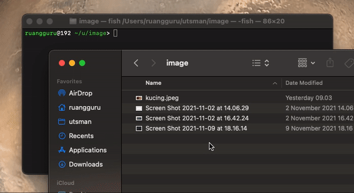

# DEPRECATED

This project deprecated, please check https://github.com/utsmannn/kartika-sari-putri

---


<h1 align="center">
  BACOT
</h1>

<p align="center">
  
</p>

<p align="center">
  <a href="https://www.npmjs.com/package/android-dpi"></a>
  <a href="LICENSE"></a>
  <a href="https://github.com/utsmannn/bacot/pulls"></a>
  <a href="https://twitter.com/utsmannn"></a>
  <a href="https://github.com/utsmannn"></a>
  <h3 align="center">Tool for generating multidensity drawable on android project</h3>
</p>

<p align="center">
  
</p>

---

This project tested on Macos.

### Setup
Install with npm
```
npm install -g android-dpi
```

### Usage 
All image file on folder
```
android-dpi .
```

Specified image
```
android-dpi foto-ktp.jpg
```

Specified multiple image
```
android-dpi meguri.jpg ai_uehara.jpg
```

### Supported format
```
['.jpg', '.jpeg', '.png', '.webp']
```

---

```
Copyright 2021 Muhammad Utsman

Licensed under the Apache License, Version 2.0 (the "License");
you may not use this file except in compliance with the License.
You may obtain a copy of the License at

    http://www.apache.org/licenses/LICENSE-2.0

Unless required by applicable law or agreed to in writing, software
distributed under the License is distributed on an "AS IS" BASIS,
WITHOUT WARRANTIES OR CONDITIONS OF ANY KIND, either express or implied.
See the License for the specific language governing permissions and
limitations under the License.
```

